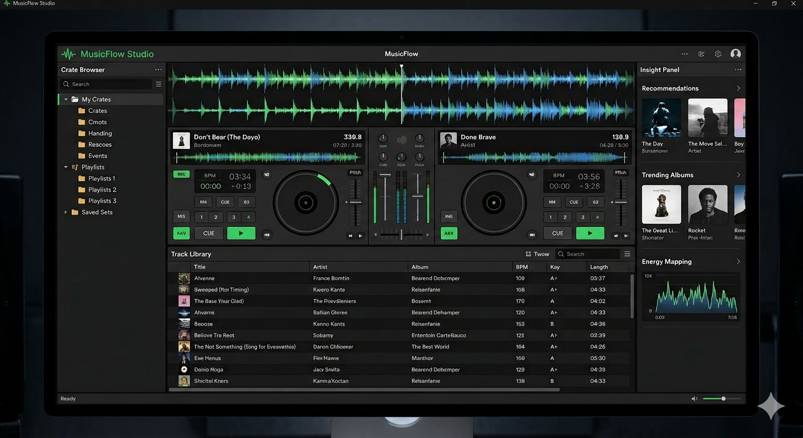

# musicflow

musicflow is a GitHub Pages-ready website for a free DJ music discovery app concept. It presents the product, shows how playlist trend analysis can help DJs surface tracks, and includes a lightweight interactive demo for filtering tracks by genre and energy.

## Mockup Preview



## Files

- `index.html`: Landing page markup
- `styles.css`: Visual design and responsive layout
- `script.js`: Demo track data and filtering logic
- `assets/musicflow-mockup.png`: Product mockup image used on the website and GitHub

## Run locally

Open `index.html` directly in a browser, or serve the folder with any static server.

Example:

```bash
python3 -m http.server 8000
```

Then open `http://localhost:8000`.

## Publish on GitHub Pages

1. Create or use a GitHub repository named `musicflow`.
2. Push these files to the repository root.
3. In GitHub, open `Settings` > `Pages`.
4. Under `Build and deployment`, choose `Deploy from a branch`.
5. Select the `main` branch and the `/ (root)` folder.
6. Save, then wait for GitHub Pages to publish the site.

If you want the call-to-action link to point to your real repository, update the GitHub URL in `index.html` with your username and the `musicflow` repository name.